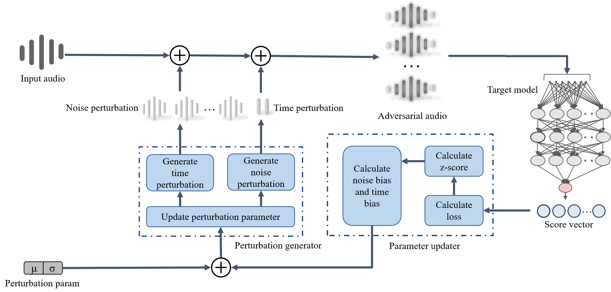

# Introduction

This repository presents SiFDetectCracker, an adversarial attack tool aimed at fake voice detection systems. The relevant paper was published in the ACM MultiMedia conference in 2023., "SiFDetectCracker: An Adversarial Attack Against Fake Voice Detection Based on Speaker-Irrelative Features".

[Paper link here](https://dl.acm.org/doi/abs/10.1145/3581783.3613841)

## Description

SiFDetectCracker, a black-box adversarial attack framework based on Speaker-Irrelative Features (SiFs) aims to targeting the fake voice detectors, which select background noise and mute parts before and after the speaker’s voice as the primary attack features. By modifying these features in synthesized speech, the target fake speech detector will make a misjudgment.

## Architecture


The framework of our approach is shown in the figure below.



SiFDetectCracker takes raw fake audio and initial perturbation parameters as input. The initial perturbation parameters control the perturbation generator generates initial time and noise perturbations, which are mixed into the raw fake audio to create initial adversarial samples. 

To evaluate the effectiveness of the adversarial samples, a target system is used to score the samples as input, which is a fake voice detection system we want to attack.

Then, the parameter updater estimates the update direction based on the scores and calculates a parameters update vector. 

Finally, the perturbation generator updates the parameters and starts the next iteration to search for new parameters if they are not effective enough until we obtain the optimal feature parameters.

# Installation

## Building or running from source.

SiFDetectCracker is a tool that can be installed using the following steps:

First, download the SiFDetectCracker source code from GitHub.

    $ git clone https://github.com/0Rambler0/SiFDetectCracker.git

## Installation requirements

Then, navigate to the SiFDetectCracker folder and run the following command to install all the dependencies the SiFDetectCracker required that are provided in requirement.txt:    

    $ pip install -r requirements.txt

__requirement.txt__:
```
graphviz
joblib==1.1.0
librosa
matplotlib
numpy
opencv_python
PyYAML==6.0
scipy
SoundFile
tensorboardX
tqdm
```

Also, you should install all of the dependencies that your target required. 
# How to Start

After the installation is complete, you can use SiFDetectCracker by following the steps below:

  1. Preparing audio [data](#data) that you want to use in SiFDetectCracker;
  2. [Adding new target](#adding-new-target) that you want to attack by adding configuration file and interface file;
  3. Start to use it with a command mentioned in [Usage](#usage).

Here we also give an [example](#example) about how to use it in practice.
## Data

You need to prepare your audio data that you want to process by yourself. 

## Adding new target

You can attack a new target simply by adding a ***configuration*** file and a ***interface*** file. 

1. Create a new folder at `./target/` and name it with your target's name;
2. Install the dependencies via the requirements.txt file from the repository of the target you selected with the same command `$ pip install -r requirements.txt` as before;
3. Define a interface file named "`test_model.py`" and place it into the folder you just created;
    - "test_model.py" must provide a model_inference function and a model create function
    - Please refer to the existing "test_model.py" we provide at `./target/RawNet2/`
    - Also, to use the test_model.py file, you also need to download a pre-trained model from the repository (if given) of the target you selected. Which means that you need both the structure and parameters of your target model
4. Create a new configuration file and adding it to the `config` folder so that you can use the command in the [usage](#usage) part.
    - Please refer to the existing configuration file we provide, and for details please refer to [configuration](#configuration) part

### Configuration

If you want to directly use the config file and its options that we provide in our config folder, you only need to change the relative path in the config file. You can also design your own config file by refering to the following descriptions:

__Configuration option__

_target_config:_

*    "__target_name__" must be the name of your target's folder which corresponds to the step 1 in the [Adding new target](#adding-new-target);


_attack_config:_

*   "__lr__" means learning rate;
*   "__sigma__" means standard deviation;
*   An epoch in machine learning refers to one complete pass through the entire training dataset. The parameter "epoch_num" means the number of epochs;
*   The parameter "__mode__" include "__normal__", "__no_time__" and "__no_noise__". "no_time" with no time perturbation and "no_noise" with no noise perturbation, and "normal" means have both of those perturbations;
*   "__perturbation_seed__" means the real voice sample that you want to use as the perturbation seed;
*   "__sigma_step_size__" means standard deviation update step size;
*   "__threshold__" means perturbation threshold;
*   "__threshold_n__" means noise perturbation threshold;
*   "__t_len__" means time perturbation length;
*   "__threshold_t__" means time perturbation threshold;
*   "__t_step_size__" means time perturbation update step size;
*   "__is_initial__" means initial mean;
*   "__population__" means adversarial samples;
*   "__eval_population__" means sample size in each iteration;
*   The parameter"__label_only__" needs to be set to 1 when the target can only output the form of a label;

_path_config:_

*   "__target_path__" should be your target's position, and if you follow our steps above, it will be `"./target"`;
*   "__save_path__" is where you want to save your results;
*   "__data_path__" is where SiFDetectCracker gets your data that you want to process.

## Usage

Use the following command as a reference for how to run SiFDetectCracker:

    python3 attack.py --config ./config/<target_name.conf>


## Example

For you to better understand how to use SiFDetectCracker in practice, we set this part to show the detail examples about how we thoroughly use it.

### Target details

For example, we choose __RawNet2__ to be our target.

_1.Folder creation_

As we choose RawNet2 to be our target, so that we create a folder named `RawNet2` under the __target__ folder

_2.Installation requirements_

The dependencies that the RawNet2 required are shown as below:

```
#cuda==10.1
numba==0.48
numpy==1.17.0
librosa==0.7.2
pyyaml==5.3.1
tensorboardX==2.1
```


_Edit files in RawNet2_

To use RawNet2, you need to edit a __test_model.py__ file first. You can refer the example in `./target/RawNet2/`:

For the model's structure and parameters, you need to download by yourself.

- RawNet2 provide a pre-trained model which follows a Mel-scale distribution of the sinc filters at the input layer, which can be downloaded from [here](https://www.asvspoof.org/asvspoof2021/pre_trained_DF_RawNet2.zip).

_Edit config file_

You also need to add a config file in the config folder, and we create config file named __RawNet2.conf__ which shown below:

```
{
    "target_config": {
        "target_name": "RawNet2"
    },

    "attack_config": {
        "lr": 0.01, 
        "sigma": 0.1,
        "epoch_num": 50,
        "mode": "normal",
        "perturbation_seed": "file1486.wav_16k.wav_norm.wav_mono.wav_silence.wav",
        "sigma_step_size": 0.01,
        "threshold": 0.05,
        "threshold_n": 0.07,
        "t_len": [0.02, 0.5],
        "threshold_t": 2,
        "t_step_size": [0.01, 0.2],
        "is_initial": 0,
        "population": 200,
        "eval_population": 400,
        "label_only": 0
    },

    "path_config": {
        "target_path": "./target",
        "save_path": "./SiFDetectCracker_exp",
        "data_path": "/data_hdd/lx20/workspaces/hx_workspace/data/Vattack_exp/exp_2023_4_12/test_audio_set_new"
    }
}
```


 If you want to directly use the config file we provide, you need to change the relative path in config files before you use.

### Start

If you follow our steps above, you can start to use SiFDetectCracker with the conmand :
    `python3 attack.py --config ./config/<RawNet2.conf>`


# Reproduction

To prove the reproducible of our experiment, we also provide descriptions about how to reproduct our work. You can also learn about more details in our [paper](https://dl.acm.org/doi/abs/10.1145/3581783.3613841) if you want.

### Target

First, you need to decide which target you want to attack. We have provided some choices of targets in the target folder that used in our experiment. Here are the links to the repositories of these targets that we provided:

_[Deep4SNet](https://github.com/yohannarodriguez/Deep4SNet)_

_[RawGAT_ST](https://github.com/eurecom-asp/RawGAT-ST-antispoofing/)_

_[RawNet2](https://github.com/asvspoof-challenge/2021/tree/main/LA/Baseline-RawNet2)_

_[Raw_pc_darts](https://github.com/eurecom-asp/raw-pc-darts-anti-spoofing)_

If you want to use one of those targets, you can install the dependencies via the requirements.txt file provided in the target's repository. You can download the requirements.txt file to the folder corresponding to the target's name or a specific location, and navigate to that location and then install them with the same command as before.

Please note that Deep4SNet use matlab to convert audio to image so you should install matlab if you want to attack Deep4SNet.

If you want to choose a target that we don't provide, you can refer to the [adding new target](#adding-new-target) part.

### Dataset

We use ASVspoof 2019 dataset in our experiment ( which can can be downloaded from [here](https://datashare.is.ed.ac.uk/handle/10283/3336) ). We select 195 samples as the test samples by using the utils in dataset utils. To get the same test samples we used in experiment, please change the path in the corresponding file and run:
```
python3 dataset_utils/create_long_audio_protocol.py
python3 dataset_utils/get_long_audio.py
python3 dataset_utils/create_exp_set.py
```

### Config file

If you want to directly use the config file we provide, you simply need to change the relative path in config file before your experiments. The details of our config file are shown in the part [Configuration](#configuration). You can refer to the description there and try other options.

Notice that the parameter "mode" include "normal", "no_time" and "no_noise", which correspond to the experiments mode in our paper. For "no_noise" mode, please set "epoch_num" to 8. 

### Start

Please refer to the command in the [Usage](#usage) part.


# Contribution Guidelines
We welcome contributions from the open-source community to enhance SiFDetectCracker 's capabilities in securing data sources. To contribute:

* Fork the SiFDetectCracker repository to your GitHub account.
* Create a new branch from the main branch.
* Follow the project's coding standards and style guidelines.
* Write clear, concise commit messages.
* Include test cases for new features or modifications.
* Update the "README.md" file for any changes or new features.
* Submit a pull request to the main branch.
* Maintainers will review and collaborate with you to address any concerns.
* Approved contributions will be merged into the main codebase.

# License
```
Copyright (c) 2024-present NAVER Corp.

Permission is hereby granted, free of charge, to any person obtaining a copy
of this software and associated documentation files (the "Software"), to deal
in the Software without restriction, including without limitation the rights
to use, copy, modify, merge, publish, distribute, sublicense, and/or sell
copies of the Software, and to permit persons to whom the Software is
furnished to do so, subject to the following conditions:

The above copyright notice and this permission notice shall be included in
all copies or substantial portions of the Software.

THE SOFTWARE IS PROVIDED "AS IS", WITHOUT WARRANTY OF ANY KIND, EXPRESS OR
IMPLIED, INCLUDING BUT NOT LIMITED TO THE WARRANTIES OF MERCHANTABILITY,
FITNESS FOR A PARTICULAR PURPOSE AND NONINFRINGEMENT.  IN NO EVENT SHALL THE
AUTHORS OR COPYRIGHT HOLDERS BE LIABLE FOR ANY CLAIM, DAMAGES OR OTHER
LIABILITY, WHETHER IN AN ACTION OF CONTRACT, TORT OR OTHERWISE, ARISING FROM,
OUT OF OR IN CONNECTION WITH THE SOFTWARE OR THE USE OR OTHER DEALINGS IN
THE SOFTWARE.
```

# Contact

For any query regarding this repository, please contact:

* Xuan Hai: haix21@lzu.edu.cn
* Xin Liu: bird@lzu.edu.cn

# Citation

If you use this code in your research please use the following citation:

```
@inproceedings{hai2023sifdetectcracker,
  title={SiFDetectCracker: An Adversarial Attack Against Fake Voice Detection Based on Speaker-Irrelative Features},
  author={Hai, Xuan and Liu, Xin and Tan, Yuan and Zhou, Qingguo},
  booktitle={Proceedings of the 31st ACM International Conference on Multimedia},
  pages={8552--8560},
  year={2023}
}
```


